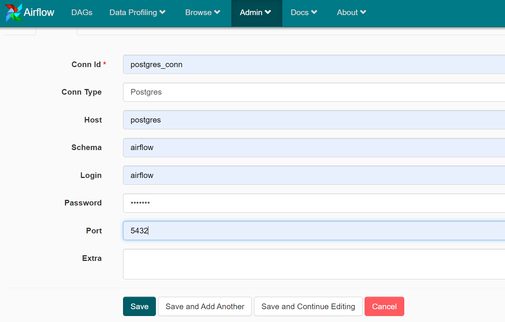
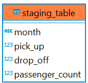
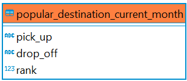
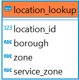
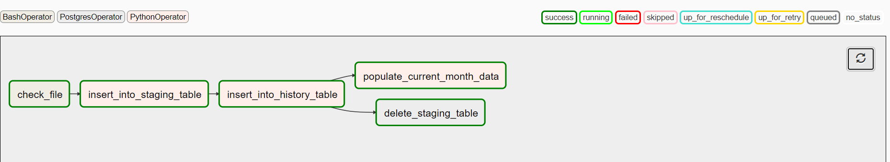

# Data engineering data pipeline using Airflow

### Objective
Building a data pipeline to ingest the data from a given file location and process them into a database.
The dataset contains information about each taxi ride in NYC.

We need to build a data pipeline which will ingest raw data,clean and
store them into the database.
We can further analyze and explore the data using SQL.

---
### Dataset

**New York Taxi Data:**

The yellow and green taxi trip records include fields capturing pick-up and drop-off dates/times,
pick-up and drop-off locations, trip distances, itemized fares, rate types, payment types, and driver-reported passenger counts.
Dataset can be found in this [link](https://www1.nyc.gov/site/tlc/about/tlc-trip-record-data.page)

---
### Assumptions made

1. The "green taxi trip records" dataset considered for this exercise.
2. There will be only one csv file "green_tripdata.csv" which will be ingested.
3. Once the file has been processed, we can delete the existing file and replace with new months csv file
4. The data pipeline will not process any duplicate data i.e reprocess the csv data into the 
   "popular_destination_history" and "popular_destination_current_month" tables.
   
---

### Tech stack

* Docker
* Python
* Airflow
* Postgres

---
### Environment Setup
- Download the project from github
- Open terminal and navigate to the project folder where docker-compose.yml file exists.
- Run the below command:
>docker-compose up -d
> 
Now the airflow and postgres containers are up and running 

Open the airflow UI at 
http://localhost:8080/admin/
---
### Airflow configuration

**Before we run dag, we need to create a postgres_conn variable.**

Below is the sample screenshot with the connection details.

---
### Data Model

When we first run the docker, the required tables are loaded into the 
postgres database.

**Tables:**

|Table Name   | Description  |
|-------------|-----------|
|staging_table|Table to store temporarily the data loaded from csv.|
|popular_destination_history|Table contains the data having the historic data of popular destinations taken by users.
|popular_destination_current_month|Table contains data related to popular destination travelled for current month.
|location_lookup| Look up table for location data. Data will be loaded during application setup.|

**staging_table**

**popular_destination_history**

**popular_destination_current_month**

**location_lookup**

---
### Tasks

The data pipeline consists of the following tasks executed in order.

1. **check_if_file_exists:**
   
   i. Check if the csv file exists in the folder location '~/data_files_airflow/green_tripdata.csv'.

2. **prepare_staging_table:**
   
   i. Read csv file from file location.
   
   ii.Pre process and clean the data in the data frame.
   
   iii.Based on the location look_up table, data in pick_up and drop_off columns are updated.
   
   iv. Insert the processed data frame into DB.
   
    v. Push xcom value which is the month field as it will be used by other task for queries. 
3. **prepare_history_table:**
   
   i. Use the keys and query staging table. 
   
   ii.Pre process and clean the dataframe. 
   
   iii.Insert data into the popular_destination_history.
4. **prepare_current_month_data:**

   i.Use the keys and query popular_destination_history table. 

   ii.Pre process and clean the dataframe. 

   iii.Insert data into the popular_destination_current_month.

5. **delete_staging_table:**
   
   i. Delete the staging table data.
---
### Order of execution

check_if_file_exists >> prepare_staging_table >> prepare_history_table >> [prepare_current_month_data,delete_staging_table]

**Sucessful DAG execution:**

---
### SQL Queries

To connect to Postgres DB to a local client.
> Host: localhost
> 
> Database: airflow
> 
> username: airflow
> 
> password: airflow
> 
> Port: 6543
> 
> -- To get the historic data of popular destinations.
> 
> select * from popular_destination_history;
> 
> -- To get the current months data for popular destinations.
> 
> select * from popular_destination_current_month
---
### Further Enhancements
* Use celery executor instead of local executor.
* Use spark to execute tasks faster than pandas library.
* Develop Unit test tasks.  
* When populating data into popular_destination_history table 
  adding additional fields like longest/shortest trips,average tip amount,etc.
* we can have separate table which can be used to generate daily or yearly reports
  instead of monthly aggregation.